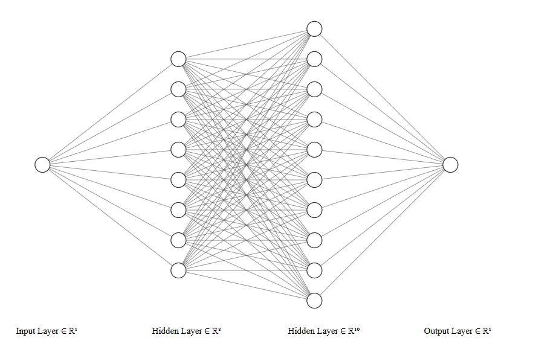
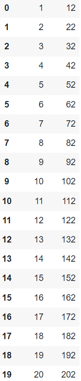
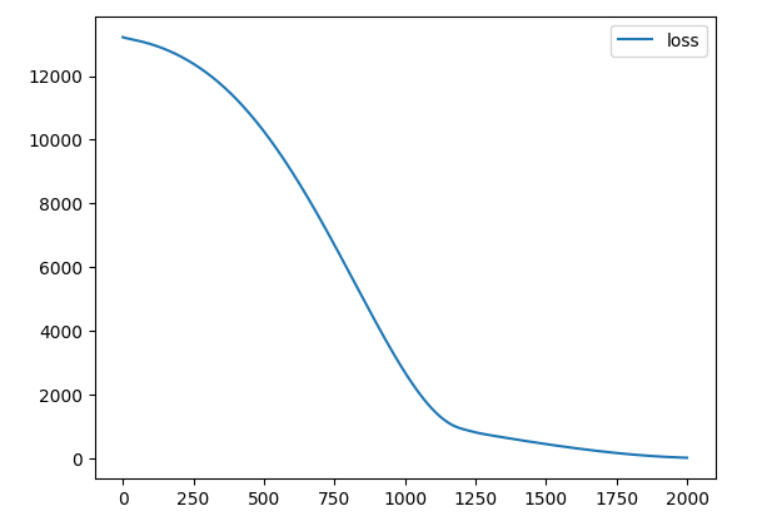
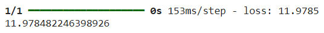
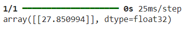

# Developing a Neural Network Regression Model

## AIM

To develop a neural network regression model for the given dataset.

## THEORY

Neural Network regression model is a type of machine learning algorithm inspired by the structure of the brain. It excels at identifying complex patterns within data and using those patterns to predict continuous numerical values.his includes cleaning, normalizing, and splitting your data into training and testing sets. The training set is used to teach the model, and the testing set evaluates its accuracy. This means choosing the number of layers, the number of neurons within each layer, and the type of activation functions to use.The model is fed the training data.Once trained, you use the testing set to see how well the model generalizes to new, unseen data. This often involves metrics like Mean Squared Error (MSE) or Root Mean Squared Error (RMSE).Based on the evaluation, you might fine-tune the model's architecture, change optimization techniques, or gather more data to improve its performance.

## Neural Network Model
!

## DESIGN STEPS

### STEP 1:

Loading the dataset

### STEP 2:

Split the dataset into training and testing

### STEP 3:

Create MinMaxScalar objects ,fit the model and transform the data.

### STEP 4:

Build the Neural Network Model and compile the model.

### STEP 5:

Train the model with the training data.

### STEP 6:

Plot the performance plot

### STEP 7:

Evaluate the model with the testing data.

## PROGRAM
### Name:Bala Sathiesh CS
### Register Number:212222040022
```python
import pandas as pd
from sklearn.model_selection import train_test_split
from sklearn.preprocessing import MinMaxScaler # Changed 'MinMaxScalar' to 'MinMaxScaler'
from tensorflow.keras.models import Sequential
from tensorflow.keras.layers import Dense
f=pd.read_csv('/content/dataset - Sheet1.csv')
f
from google.colab import auth
import gspread
from google.auth import default
auth.authenticate_user()
creds,_=default()
gc=gspread.authorize(creds)
worksheet=gc.open('dataset').sheet1
data=worksheet.get_all_values()
x=dataset1[['Input']]
y=dataset1[['Ouput']]
x_train,X_test,y_train,y_test=train_test_split(x,y,test_size=0.33,random_state=33)
Scaler=MinMaxScaler()
Scaler.fit(X_train)
X_train1=Scaler.transform(X_train)
ai_brain=Sequential([
    Dense(8,activation='relu'),
    Dense(10,activation='relu'),
    Dense(1)
])
ai_brain.compile(optimizer='rmsprop',loss='mse')
ai_brain.fit(X_train1,y_train,epochs=2000)
loss_df=pd.DataFrame(ai_brain.history.history)
loss_df.plot()
X_test1=Scaler.transform(X_test)
X_n1 = [[2]]
X_n1_1=Scaler.transform(X_n1)
ai_brain.predict(X_n1_1)

```
## Dataset Information



## OUTPUT

### Training Loss Vs Iteration Plot



### Test Data Root Mean Squared Error



### New Sample Data Prediction



## RESULT

Thus the neural network regression model for the given dataset is executed successfully.
